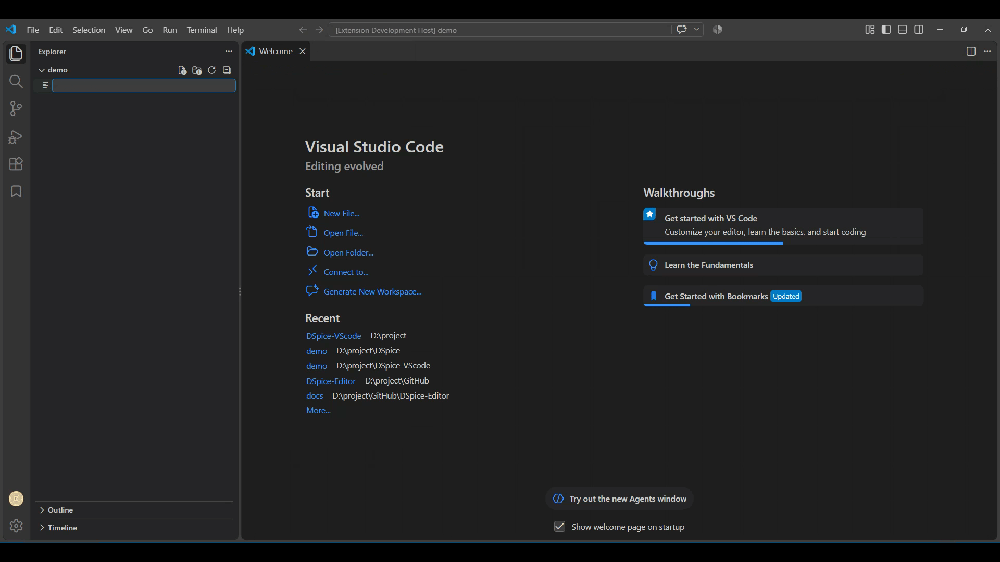

# DSpice: Designing and Simulating Analog and Digital Circuits

DSpice is a professional, cross-platform circuit design and simulation environment built for VS Code. It provides a powerful graphical schematic designer and delivers precise waveform simulation results powered by the robust **ngspice** engine.

## What’s New 

**v0.1.5 (Current)**

### Added
- **Simulation Analysis Scope:** OP (Operating Point) analysis is now fully functional and supported, while TR (Transient), DC, and AC analyses are postponed to upcoming releases.
- **Description Pane Controls:** Added a dedicated button to toggle (show/hide) the circuit description pane.
- **Element Type Display:** Enhanced the description panel to dynamically show the currently selected element type.
- **Symbol Model Management:** Added an "add model" button specifically tailored for symbol (`.sym`) files.

### Changed
- **Comprehensive Theme Support:** Updated colors for Rectangle, Ellipse, Arc, Polygon, Polyline, Wire, and Pin shapes, along with toolbar button SVGs, to ensure seamless compatibility with all VS Code themes.
- **HTML Description Theming:** Added full VS Code theme support to the HTML circuit description view and refined symbol list styling.
- **Basic Symbol Refinement:** Updated the colors and naming conventions of basic symbols, including ports, V bar, and GND.

## Screenshots

## Key Features
- **Graphical Schematic Designer:** Intuitive interface for drawing and designing circuit schematics.
- **Advanced Simulation Engine:** Powered by ngspice for accurate analog and mixed-signal circuit simulations (DC, AC, Transient).
- **Interactive Waveform Viewer:** Visualize and analyze simulation results with an interactive graph viewer, featuring PNG export capabilities.
- **Extensive Component Library:** Includes a wide range of SPICE models (BJT, MOSFET, JFET, Diodes, OP-AMPs, and more).
- **Cross-Platform:** Built with ElectronJS, offering a seamless experience on Windows and Linux.

## Installation
1. Open VS Code
2. Go to Extensions (Ctrl+Shift+X)
3. Search for "DSpice"
4. Click Install

## Usage
1. Open DSpice from the Activity Bar
2. Create a new schematic
3. Add components from the library
4. Run simulation and view waveform results

## Requirements
- VS Code 1.70.0 or higher

## Document
- https://dspice-vscode.readthedocs.io

## License
MIT License - See LICENSE file for details

## Support
For issues and feature requests, please visit: https://github.com/GDSpice/DSpice-VSCode/issues